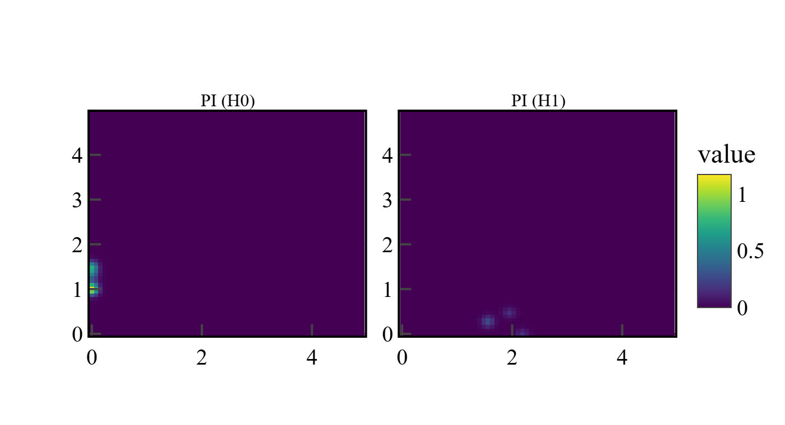
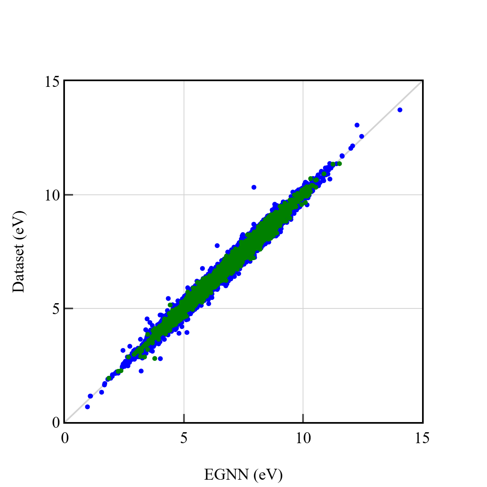
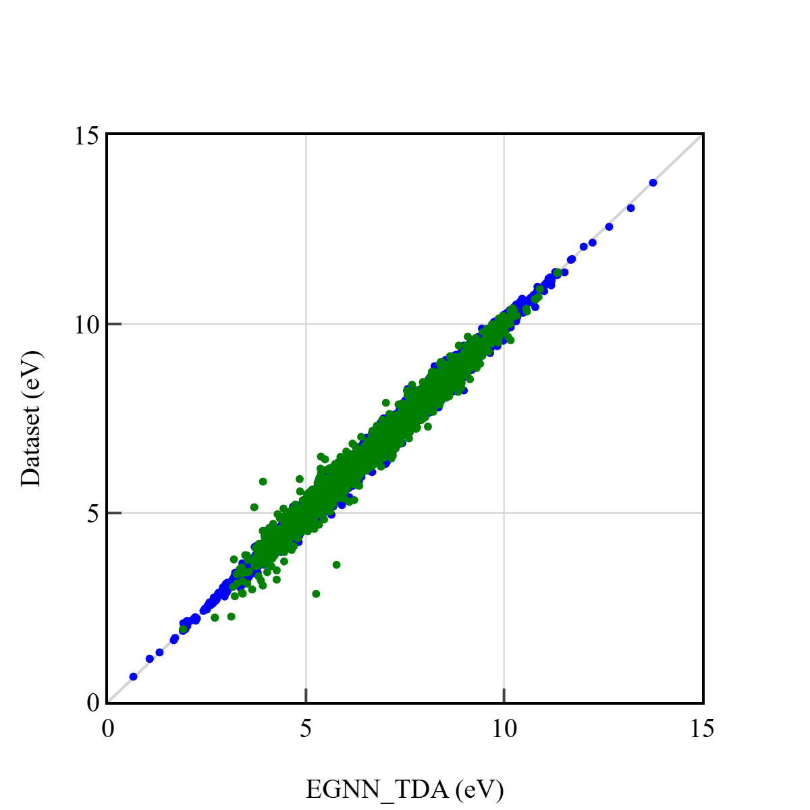

EGNN+TDA

Stepik: 187053348

# Введение

Работа представляет собой выпускной проект в рамках курса "Deep Learning School. Часть 1" направления "Geometric ML".
Целью данной работы является построение модели на базе архитектуры EGNN с использованием признаков из Topological Data Analysis.
В исследовании используется набор данных QM9 с целевой переменной равной разницe HOMO и LUMO (далее `gap`).

# Набор данных

Для работы с данными в `dataset.py` реализованы несколько трансформеров, позволяющих следующее:

* уменьшить размер датасета с фильтром максимального числа атомов в молекуле (`MaxAtomsFilter`);
* извлечь целевую переменную и изменить число интересующих признаков (`Add_node_attrs`);
* удалить ненужные аттрибуты датасета (`DropFields`);
* строить диаграммы персистентности и организовывать на их основе (с помощью размывания) изображения персистентности (PI) (`TDA_transform`).

Новый датасет имеет два новых аттрибута: node_attr, куда собраны все рассматриваемые признаки узлов, и pi, которые представляют собой трехканальные массивы из H0 (связные компоненты) и H1 (кольца и петли).

Признак заряда атома был исключен из рассмотрения, поскольку эта информация дублируется в аттрибуте x, то есть дублируется.
Итого, в node_attr содержатся признаки: H?, C?, N?, O?, F?, заряд атома, ароматичность?, sp?, sp2?, sp3?, число атомов водорода, связанных с атомом.
Знаком ? указаны качественные признаки.

# Модель

В проекте реализована упрощенная версия архитектуры EGNN, представленная в статье https://arxiv.org/abs/2102.09844 .
Данная модель основывается на E(3) Equivariant Graph Convolution Layer (EGCL), который в данной работе реализован на основе класса `torch_geometrcic.nn.MessagePassing`.
Реализованный класс `GCL` принимает на вход количество скрытых признаков `hidden_dim` (в данной работе равен 64) и флаг `equivariant`, позволяющая работать как с инвариантной моделью, так и с эквивариантной.
В рамках изложенной задачи допускается работать с инвариантной моделью (`equivariant = False`), поскольку авторы статьи не отметили никаких улучшений.
Соотвественно, в проекте используется инвариантная модель. Для `MessagePassing` переписаны функции `message` и `aggregate` (в соответствии со статьей), а также сама функци `forward`.
Удобство использования `MessagePassing` класса заключается в том, что наследуемые функции позволяют легко реорганизовать входы из `forward` (`h, x, edge_index, edge_attr`) в последующую цепочку вызовов `propogate`.

Представлены два варианта моделей - `EGNN` и `EGNN_TDA`, последняя из которых использует PI.
Обе модели начинаются с эмбеддинга аттрибутов узлов и ребер графа. Далее графы проходят через несколько `GCL` (в данной работе их было 7).
И на выходе несколько линейных слоев, затем пулинг и несколько дополнительных линейных слоев, предсказывающих целевую переменную.
Разница моделей заключается в том, что после пулинга в моделе с TDA имеется конволюционный слой с последующей активацией.
Далее эти признаки проходят через линейный слой и конкатенируются с выходом из пулинга.
Затем аналогичным образом предсказывается целевая переменная. Таким образом, PI используется как глобальный признак.

Иллюстрация H0 и H1 для некотором конфигурации представлена ниже.



# Обучение и валидация

Обучение проводилось на полном датасете QM9, со следующими аттрибутами узлов: H?, C?, N?, O?, F?, ароматичность?, sp?, sp2?, sp3?, число атомов водорода, связанных с атомом.
Тренировочная выборка составляла 90%, в то время как валидационная - 10%. Оптимальный размер батча - 64, так как при увеличении растет переобучение. Пример обучения представлен в `notebook/egnn_tda_train.ipynb`. 
В работе использована среднеквадратичная функция ошибок. Оптимальная модель выбиралась по минимуму ошибки на валидационной выборке.

Для оптимизации обучения целевая переменная представлась как разница между текущем значением и средним по тренировочному датасету. То есть для получения значения `gap` нужно к выводу модели добавить среднее.
В папке `checkpoints` имееются обученные модели. Можно загружать следующим образом:

```commandline
ckpt = torch.load("checkpoints/egnn_qm9_gap.pt", map_location="cpu")
model.load_state_dict(ckpt["model_state"])
y_mean = ckpt["mean_y"]
```

# Результаты

В оригинальной статье отмечается, что средняя абсолютная ошибка составляет 48 meV, поэтому далее используется именно эта характеристика.

Ниже представлены графики, иллюстрирующие точность обученных моделей `EGNN` и ниже `EGNN_TDA`. Синим цветом указаны точки обучающей выборки и поверх них лежат зеленые точки валидационной выборки.



MAE (train): 91.49 meV

MAE (valid): 90.03 meV



MAE (train): 71.71 meV

MAE (valid): 97.77 meV

Локальные выпады синих точек тренировочной выборки могут быть легко устранены переобученной моделью. Однако, она не представляет практической ценности.
Простая модель EGNN показывает несколько лучший результат, поскольку дает несколько меньшую ошибку на валидационной выборке. Также интересно, что большинство точек валидационной выборки лежат внутри дисперсии данных предсказанных для тренировочной выборки.
Несколько более сложное поведение характерно для EGNN_TDA модели, поскольку, по всей видимости, конволюционный слой вносит сложности в обучение, основываясь на среднеквадратичной ошибке.
Полагалось, что PI сможет внести некоторую поправку, обусловленную особенностями глобальной структуры молекулы.
Наверное, более удачным случаем будет анализ PI, где дисперсия задается не вручную через Гауссово размытие, а путем анализа гораздо более массивных структур с большим разнообразием H0 и H1. Также интересно добавление H2.
Однако, в целом результаты довольно близки.

# Установка среды

``` 
conda env create -f environment.yml
conda activate egnn_tda
```